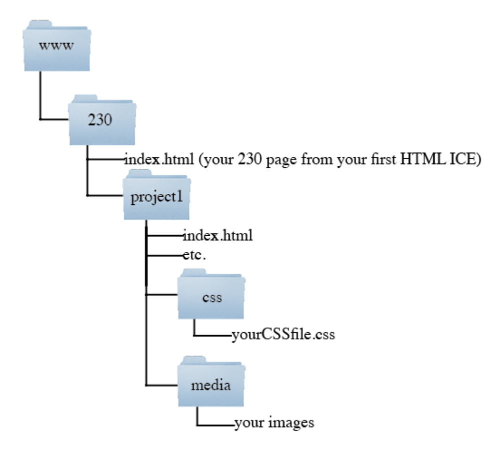

# Project 1 - Tutorial Web Site - Deliverable A

***Note: The requirements for this deliverable are the basic layout and content - we will do most of the styling and responsiveness later.***

## I. Overview
- You are going to be building a responsive (mobile/tablet/desktop friendly) content-driven web site.
- The content will be a *tutorial* of your creation. Here's wikipedia's definition - ***A tutorial is a method of transferring knowledge and may be used as a part of a learning process. More interactive and specific than a book or a lecture, a tutorial seeks to teach by example and supply the information to complete a certain task.***
- the *subject* of the tutorial could be anything that is SFW, but also try to make it something that you are personally invested in:
  - you are already accomplished at the subject of the tutorial, thus you are a natural teacher of the subject **OR**
  - it is a subject that you would like to get better at, thus you are going to get learn more about the subject, then teach it to others
  - the subject of the tutorial must not be trivial - ex, *"How to boil tap water"*
- This will be a text-based tutorial - no video or audio - sorry
- This is a SOLO project
- Examples (from the web):
  - https://www.raywenderlich.com/4161005-mvvm-with-combine-tutorial-for-ios
  - https://jerryjenkins.com/how-to-write-a-book/
  - https://houseofyumm.com/barbacoa/

## II. Required Content

### II-A. tutorial.html
The main page of the tutorial is named **tutorial.html** and it has the following content:

- The title of what the tutorial is for.
- A brief description of the tutorial (the subject, and what the user will get out of it)
- At least 6 steps in the tutorial, containing a total of at least 500 words
- Images for the tutorial steps:
  - Images must be in a web friendly image format (gif, jpg, or png) AND of appropriate dimensions for the web.
- Optional: Any other information about the subject of the tutorial. This could be links to the subject, information about the subject, etc. Put this content is a separate `
`, or in an `<aside>`. 

### II-B. index.html

- **index.html** which will be the *landing page*. It matches the other page's design and navigation, and tells us the following:
  - Why this topic is worth knowing and why you chose it
  - Cite the sources of all information, tutorials, images and other media used
  
### II-C. ???.html 
- You are, of course, free to add additional pages as they make sense within the context of your tutorial.

  
## III. HTML Markup
-	Structural tags like `<header>`, `<section>`, `<article>`, `<nav>`, and `<footer>` should be used appropriately.
- Inline text marked up as appropriate
- Try to use a consistent structure on all of your pages by repeating many of your design elements - for example: the `<header>`, `<footer>` and `<nav>` elements should be in the same places on each page and have the same colors, fonts and spacing.
- You must have descriptive `<title>` elements for each page.

## IV. CSS
-	CSS selectors and rules will be used for text formatting: 
  - Most of the style rules will be located in an external style sheet.
  -	There will be at least 5 style declarations (rules) in your external style sheet. 
  - Avoid using *inline* styles.
  
## V. Other Requirements

### V-A. Navigation
- you need two *navigation systems*:
  - a *global* navigation system - this system will be present on both **index.html** and **tutorial.html** (as well as any other optional pages you have added)
  - a *local* navigation system on **tutorial.html**:
    - this system will make it easy for the user to "jump" to various steps of the tutrorial easily
    - see the "Content" navigation element on this wikipedia page for an example: https://en.wikipedia.org/wiki/Slime_mold
    - this is accomplished with HTML *fragments*
    - for a working example, see "Linking to a Specific Point in a Page" in LWD chapter 6 
    
### V-B. Validation
The HTML & CSS of all pages must be structurally correct & *validate* to current standards:
- https://validator.w3.org
- https://jigsaw.w3.org/css-validator/

## VI. Design
- College-level work - do the best work you can within the time allotted

## VII. Location of pages 

- The pages will be named as above and be located in the `project1` directory in your `230` directory on Banjo. This means that the location of page on the web will be **`http://people.rit.edu/abc1234/230/project1/`** (where 'abc1234' is your RIT id), as shown below
- Your **index.html** will be the default page for this directory
- You must have `css` and `media` directories to store the associated style and image files

## VIII. Submission Requirements

- See myCourses for submission instructions including where to post your link

