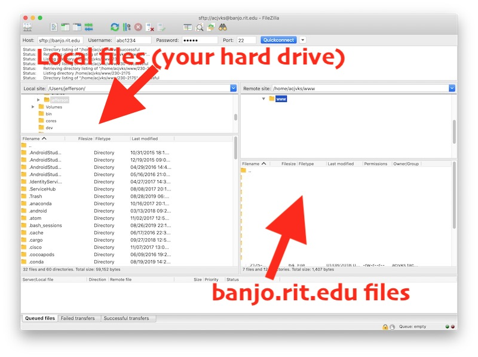

# Week 1B - How the web works / *banjo.rit.edu* & FTP

## Topics
- I. How the web works
- II. A Simple Web Page
- III. Demo: FTP & Setting up your `230` directory on banjo.rit.edu

## I. How the web works

- We will look at the LWD chapter 2 slides in class. These give a nice overview of how web pages are transmitted, assembled and displayed by web browsers
- Next, follow allow along with the instructor as we explore the headers sent by browsers and servers.
    - Notes: [HTTP Protocol Intro](https://github.com/tonethar/IGME-235-Shared/blob/master/notes/http-protocol-intro.md)
    - Demo: [HTTP Protocol Demo](https://github.com/tonethar/IGME-235-Shared/blob/master/notes/http-protocol-demo.md)
    
## II. A Simple Web Page

1) Fire up a text editor such as NotePad++, Visual Studio Code, or Brackets and create and save the following file. NOTE: *Be sure to use **type** "plain text" or "HTML", do NOT create web pages of type "rich text"*

- Note: We will give a quick explanation of what's going on here in class, but LWD chapters 3 & 4 will also walk you through the creation of a simple web page and give additional information

**hello.html**
```
<!DOCTYPE html>
<html lang="en">
<head>
	<meta charset="utf-8" />
	<title>Hello Page</title>
	<style>
	h1{
	  font-family:sans-serif;
	}
	
	p:first-of-type{
		font-style:italic;
	}
	</style>
</head>
   <body>
      <h1>Week 1 in 230!</h1>
      <p>We will be learning a lot this semester!</p>
      <p>Course GitHub is here: <a href="https://github.com/tonethar/IGME-230-Fall-2019">IGME-230 Fall 2019</a></p>
      <!-- 	This simple page actually has a lot going on in it! -->
      <!-- 	These are HTML comments that is not visible in the browser window -->
   </body>
</html>
```

2) Now open the page up in a web browser, it should look something like this:


## III. FTP Demo

- **FTP** stands for **File Transfer Protocol** - which is a way of transferring files between computers
- `banjo.rit.edu` is the address of the web server that hosts files for people.rit.edu, which is where your personal RIT account is located 


### III-A. Connect to the banjo.rit.edu server

1. Fire up *Filezilla* (which is on the lab PCs) or a similar FTP client
2. FTP clients need 4 pieces of information before they can connect to a server
- the **address** of the server to connect to (for today this is ***banjo.rit.edu***)
- the **user id** of the account where you want to post files (your RIT ***`abc1234`*** id)
- the **password** of the account (your ***password***)
- the **port** you wish to connect to (this is ***22*** which is SFTP - "Secure FTP")
- Make it so!


<hr>

### III-B. Create a 230 folder

- Now that you are connected, you can see your computer's files on the left side of the screen, and the banjo.rit.edu files on the right
- Go ahead and click on the folders on the right side of the Filezilla window so that the **`www`** folder is selected




- with the **`www`** folder selected, go ahead and right-click and choose "Create Directory" from the pop-up menu
- name the new directory **`230`**


- select the 230 folder, right-click,  and choose "File Attributes..."
- make the attributes of the folder match the screenshot below. These are the correct file permissions anytime you create a folder on banjo:


<hr>

### III-C. Verify that your 230 folder is visible on the web

- Point a web browser at `http://people.rit.edu/~abc1234/230` (where `abc1234` is your id) - you should see an empty folder like this below. If it doesn't look right, go ahead and ask for help from a neighbor, or the TA or Prof


 
<hr>

### III-D. Post hello.html to the web

- This is easy! Head back to Filezilla. With the **`230`** folder selected, just drag the **hello.html** file to the window, and the **hello.html** file will upload automatically.
- You will also need to right-click and choose "File Attributes..." for **hello.html** - for files (as opposed to folders) the permissions will usually look like this:


### III-D. Verify that your hello.html file is visible on the web

- Point a web browser at `http://people.rit.edu/~abc1234/230/hello.html` (where `abc1234` is your id) - you should see the web page!


<hr>

### III-E. Submission

- Head to the myCourses **Assignments** area to submit your link!

<hr><hr>

| <-- Previous Unit | Home | Next Unit -->
| --- | --- | --- 
| [**week-01A-notes.md**](week-01A-notes.md)     |  [**IGME-230 Schedule**](../schedule.md) | [**week-02-notes.md**](week-02-notes.md)
